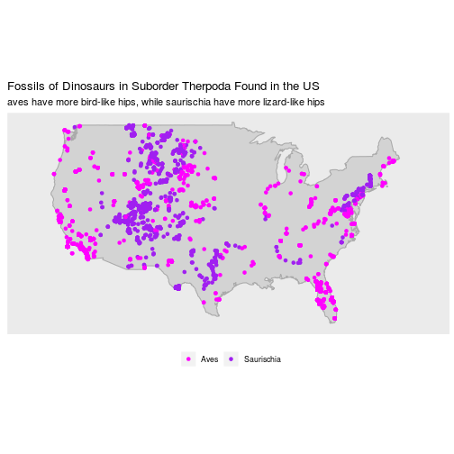

# Section 1: Dino Map!

## The Paleobiology Database

* non-government, non-profit, publicly-accessible resource for paleontological data

* organized / operated by an international, multi-disciplinary group of paleobiological researchers

* primary goal to provide global, collection-based occurrence and taxonomic data for organisms of all geological ages, as well data services for independent development of analytical tools, visualization software, and applications

* broader goal is to encourage and enable collaborations that address large-scale paleobiological questions

* You can filter and download records [HERE](https://paleobiodb.org/classic/displayDownloadGenerator) in many formats

## Plot of Suborder Therpoda

